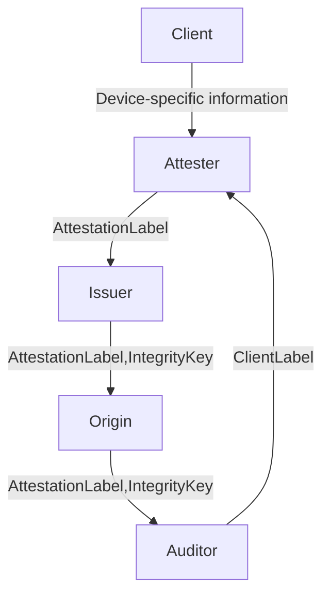

# TypeFFFF Experimental Tokens

This package implements prototype support for a new token based on Google's Web Environment Integrity (WEI) token proposal, located here: https://docs.google.com/presentation/d/1EH5F0D0qU5M_cLA_bfP-Mb-XBMDj36fG4L8IyonbsIs/edit#slide=id.g2258310cac2_0_0.

The implementation is built in a way that can reuse the HTTP authentication mechanism specified in the IETF Privacy Pass working group: https://ietf-wg-privacypass.github.io/base-drafts/draft-ietf-privacypass-auth-scheme.html. In particular, this means clients can reuse the TokenChallenge and Token structures on the wire. The new token type simply introduces a new way for verifying the individual Token structures.

In a bit more detail, given a TokenChallenge, each Token is packed in the following way

```
struct {
    uint16_t token_type;           // 0xFFFF
    uint8_t nonce[32];             // Client-chosen nonce
    uint8_t challenge_digest[32];  // Hash of the corresponding TokenChallenge
    uint8_t token_key_id[Nid];     // A fixed-length tuple of (Ed25519 public key, attestation label, issuer signature)
    uint8_t authenticator[Nk];     // Ed25519 signature
} Token;
```

The most interesting part here is Token.token_key_id. For this token type, Token.token_key_id contains a certified public key and attestation label (an opaque byte string) that are signed by the issuer. This certified public key is used for verifying Token.authenticator. In particular, origins validate these tokens as follows.

1. Parse Token.token_key_id into (Ed25519 public key, attestation label, issuer signature).
2. Verify that the issuer signature is valid over the (Ed25519 public key, attestation label) message using the issuer's expected public key. If this fails, abort.
3. Verify that Token.authenticator is a valid signature over the token authenticator input (all preceding data). If this fails, abort.
4. Accept the token.

Conceptually, Token.token_key_id is "the key used to verify Token.authenticator," so this works out.

Drilling into the details, this packing requires Token.token_key_id to be a fixed length. Both the Ed25519 public key and issuer signature are fixed length, which is not an issue. All that remains then is the attestation label. Constructing this is the tricky piece, and is key to the feedback loop.

## Feedback Loop

The feedback loop for WEI tokens allows for attesters to learn about suspicious client devices from origins without learning which origin those clients are connecting to. This is done amongst five parties -- Client, Attester, Issuer, Origin, and Auditor. The flow of information in this feedback loop is below.



In this arrangement, each party is responsible for the following.

- Attester: The entity responsible for verifying and safeguarding client-specific device information. It sees:
    - Client-specific device information revealed during the attestation check; and
    - Client-chosen attestation label
- Issuer: The entity responsible for producing client-specific integrity keys that are used for producing WEI Privacy Pass tokens. It sees:
    - Encrypted and signed attestation label (the label encrypted under the auditor's public key)
    - Client-chosen integrity keys
- Origin: The entity that consumes and verifies WEI Privacy Pass tokens and, optionally, reports tokens to the auditor in the event of suspicious client behavior. It sees:
    - Encrypted and signed attestation label (the label encrypted under the auditor's public key)
    - Client-chosen integrity key
    - WEI token
- Auditor: The entity responsible for completing the feedback loop between origins and attesters. It sees:
    - Client-chosen attestation label
    - Origin name

Importantly, no single party ever learns client-specific device information and origin-specific information.

## Attestation Label

Fundamentally, a label is an index into a database that the attester uses for looking up client-specific device information. The label is a random 32 byte string that the client controls, thereby making sure it's not maliciously chosen, e.g., as a tracking vector or similar. We refer to this label as the client label.

The purpose of the attestation label structure is to pass this label through the feedback loop in a way that does not compromise any individual user's privacy. In particular, the only parties that learn the client label are (1) the attester and (2) an audit server, and the attester only completes the loop if the audit server process

At a high level, the attestation label consists of the following information:

```
struct {
    uint8 label_commitment[32]
    uint8 attester_label[80]
    uint8 signature[256]
} AttestationLabel;
```

Each of these fields is as described below:

- label_commitment: A commitment to the client label that the attester uses to index into its database of past attestations. The attester will use this to look up device specific information should it need to debug any reported attestation failures from the auditor.
- attester_label: An encryption of the label under the auditor's public key.
- signature: A signature over (label_commitment, attester_label) by the attester's signing key. This is used by the issuer to confirm that the attestation label is valid.

Attestation labels are "minted" by the attester, and then propogated through the feedback loop inside WEI tokens. Origins can then relay them to the auditor if they believe a particular token comes from a compromised or suspicious client. Upon receipt, an auditor can decrypt the AttestationLabel.attester_label, check that it matches the commitment (AttestationLabel.label_commitment), and, if so, report the label_commitment to the attester for debugging.

The auditor can also publish a list of label commitments (AttestationLabel.label_commitment values) it reports for the sake of transparency. Honest clients can use this to determine if their labels were mistakenly or maliciously reported by origins.
