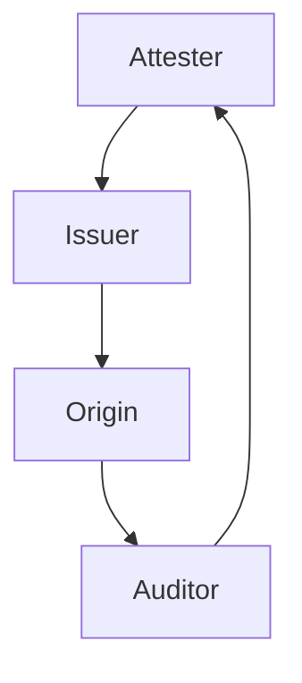

# TypeFFFF Experimental Tokens

This package implements prototype support for a new token based on Google's Web Environment Integrity (WEI) token proposal, located here: https://docs.google.com/presentation/d/1EH5F0D0qU5M_cLA_bfP-Mb-XBMDj36fG4L8IyonbsIs/edit#slide=id.g2258310cac2_0_0.

The implementation is built in a way that can reuse the HTTP authentication mechanism specified in the IETF Privacy Pass working group: https://ietf-wg-privacypass.github.io/base-drafts/draft-ietf-privacypass-auth-scheme.html. In particular, this means clients can reuse the TokenChallenge and Token structures on the wire. The new token type simply introduces a new way for verifying the individual Token structures.

In a bit more detail, given a TokenChallenge, each Token is packed in the following way

```
struct {
    uint16_t token_type;           // 0xFFFF
    uint8_t nonce[32];             // Client-chosen nonce
    uint8_t challenge_digest[32];  // Hash of the corresponding TokenChallenge
    uint8_t token_key_id[Nid];     // A fixed-length tuple of (Ed25519 public key, attestation label, issuer signature)
    uint8_t authenticator[Nk];     // Ed25519 signature
} Token;
```

The most interesting part here is Token.token_key_id. For this token type, Token.token_key_id contains a certified public key and attestation label (an opaque byte string) that are signed by the issuer. This certified public key is used for verifying Token.authenticator. In particular, origins validate these tokens as follows.

1. Parse Token.token_key_id into (Ed25519 public key, attestation label, issuer signature).
2. Verify that the issuer signature is valid over the (Ed25519 public key, attestation label) message using the issuer's expected public key. If this fails, abort.
3. Verify that Token.authenticator is a valid signature over the token authenticator input (all preceding data). If this fails, abort.
4. Accept the token.

Conceptually, Token.token_key_id is "the key used to verify Token.authenticator," so this works out.

Drilling into the details, this packing requires Token.token_key_id to be a fixed length. Both the Ed25519 public key and issuer signature are fixed length, which is not an issue. All that remains then is the attestation label. Constructing this is the tricky piece, and is key to the feedback loop.

## Feedback Loop

The feedback loop for WEI tokens allows for attesters to learn about suspicious client devices from origins without learning which origin those clients are connecting to. This is done with four parties -- Attester, Issuer, Origin, and Auditor -- as shown below.



In this arrangement, each party only sees the following information:

- Attester:
    - Client-specific device information revealed during the attestation check; and
    - Client-chosen attestation label
- Issuer:
    - Encrypted and signed attestation label (the label encrypted under the auditor's public key)
    - Client-chosen integrity keys
- Origin:
    - Encrypted and signed attestation label (the label encrypted under the auditor's public key)
    - Client-chosen integrity key
    - WEI token
- Auditor:
    - Client-chosen attestation label
    - Origin name

Importantly, no single party ever learns client-specific device information and origin-specific information.

## Design Sketch

XXX(caw): writeme